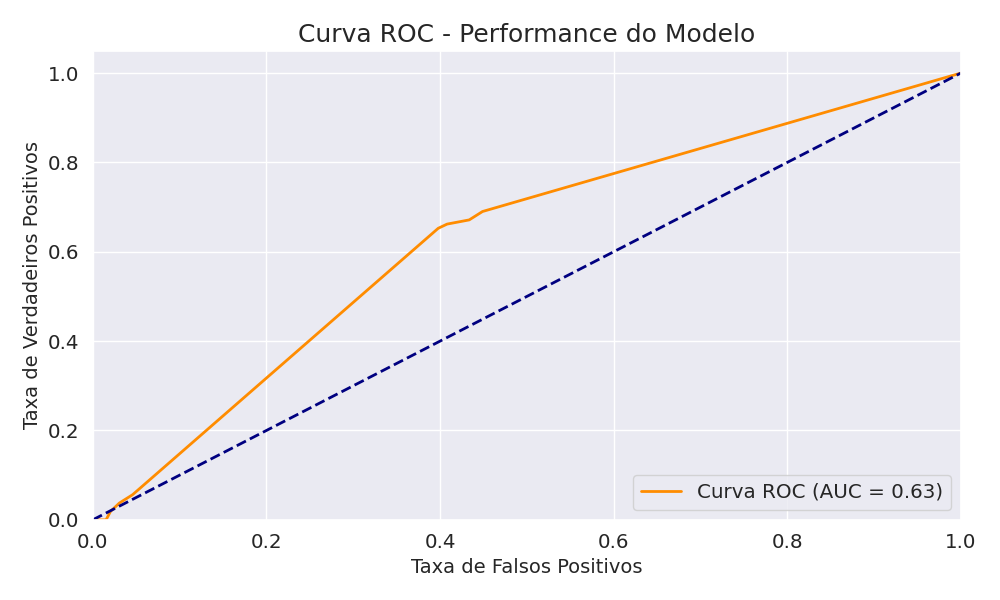
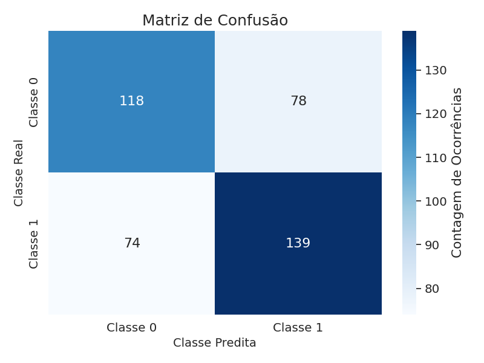

# MetodologiaCientifica
Repositório utilizado para a disciplina de metodologia científica com o objetivo de aprender a escrever trabalhos científicos.

# Predição de Vitória em Partidas de Tênis com Regressão Simbólica

Este repositório apresenta o trabalho de faculdade que utiliza **regressão simbólica** para prever a vitória em partidas de tênis a partir de múltiplos parâmetros dos jogadores e partidas.

---

## Descrição
O objetivo do trabalho foi aplicar **regressão simbólica** para tentar prever a vitória em partidas de tênis utilizando diversos parâmetros, como ranking dos jogadores, altura, idade, etc.  
O processo incluiu todo o pré-processamento de dados, transformação de variáveis para facilitar o treinamento do modelo, e a divisão do dataset em treino, validação e teste.

---

## Artigo
O artigo completo está disponível [aqui](artigo_nathan.pdf) e descreve detalhadamente:
- Metodologia
- Pré-processamento
- Transformação das variáveis
- Treinamento do modelo de regressão simbólica
- Análise dos resultados

---

## Pré-processamento e Dataset
- Conjunto de dados dividido em:
  - `treino.csv` → para treinar o modelo
  - `validacao.csv` → para ajustar parâmetros e evitar overfitting
  - `teste.csv` → usado apenas para avaliar o desempenho final
- Foi realizada a **junção e transformação das variáveis**, garantindo que os dados estivessem no formato ideal para o modelo simbólico.

---

## Código
- O código que define os parâmetros do modelo, carrega o dataset e inicia o treinamento está disponível em `reg.py`
---

## Resultados
A equação escolhida ficou com uma acurácia de 62,8%, com uma complexidade 5.

Melhor equação encontrada pelo modelo (simplificada):
`y = sin(erf(diff_rank) + 1.2628733e7)`

